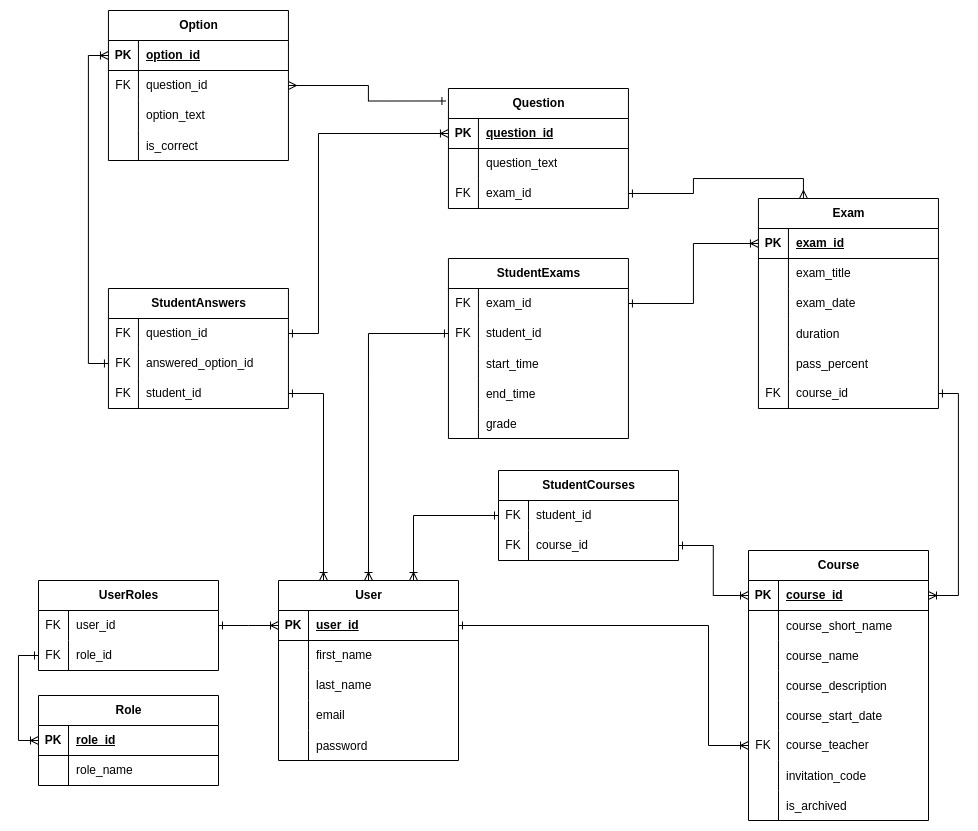

# Introduction

Online quiz system will not contain any lectures or course materials for teaching. It's only
purpose is to examine the students by the courses they joined.

There are three main type of user roles: Student, Teacher, Admin (not implemented) and role
based access control implemented for each role.

Every user may have multiple roles, but only authorized to single role which is chosen when
logging in.

## Technologies

### Backend

Backend provides an API for the clients, which is built using ExpressJS and MySQL. User authentication is implemented using session cookies.

### Frontend

Frontend is built as single page application using ReactJS, and Redux Toolkit is used for complex state management.

## How to run the app?

This project is separated under two main folders: backend and frontend folder.

They should run separately to access the app.

### Database

This system is built using 8.4.0 - MySQL Community Server

Database connection details are stored as environment variables inside [.env](backend/.env.example) file. These values are used in database config file [config/db.js](backend/src/config/db.js).

Database creation and seeding data are automized with [utils/seed.js](backend/src/utils/seed.js) script. To run the script run the following npm script: `npm run seed-db`. This script drops & creates all the tables.

### Backend

Backend can be started using `npm start` script. Backend is set to use port 5000 by default.

### Frontend

Frontend can be started using `npm start` script. Frontend runs on port 3000 by default.

After setting up all the components, application should be accessible from <http://localhost:3000>

## Login Details

Login requires email and password of users, and there are 5 users in the app by default. All default users has the same password: **password**

- Teacher
  - `johndoe@example.com` - **password**
  - `example@example.com` - **password**
- Student
  - `janedoe@example.com` - **password**

## Entity Relationship Diagram

